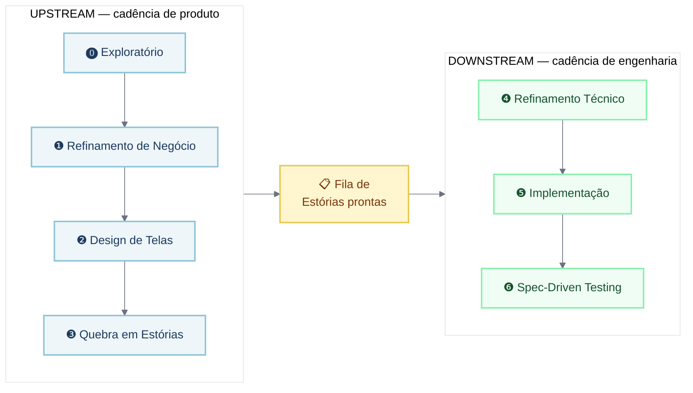
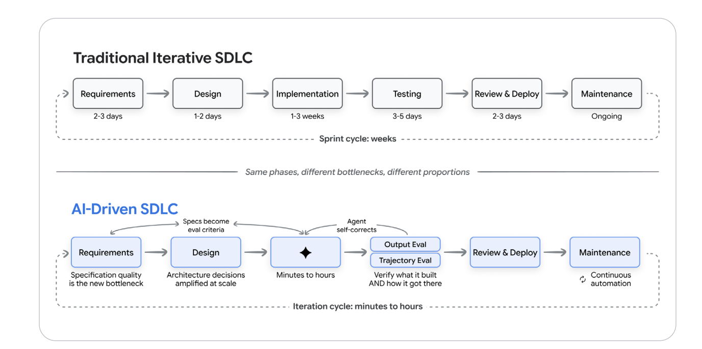
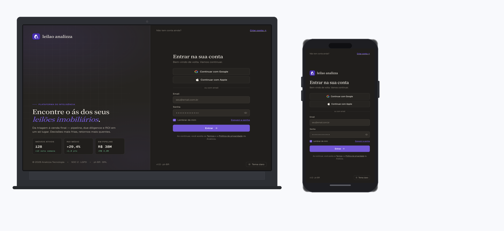
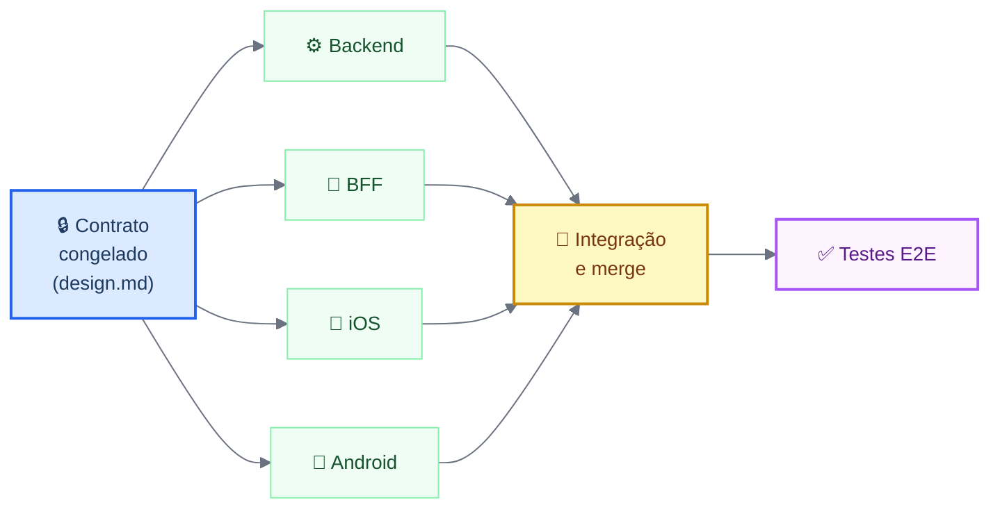
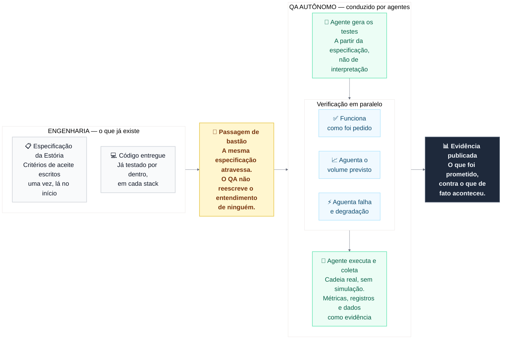
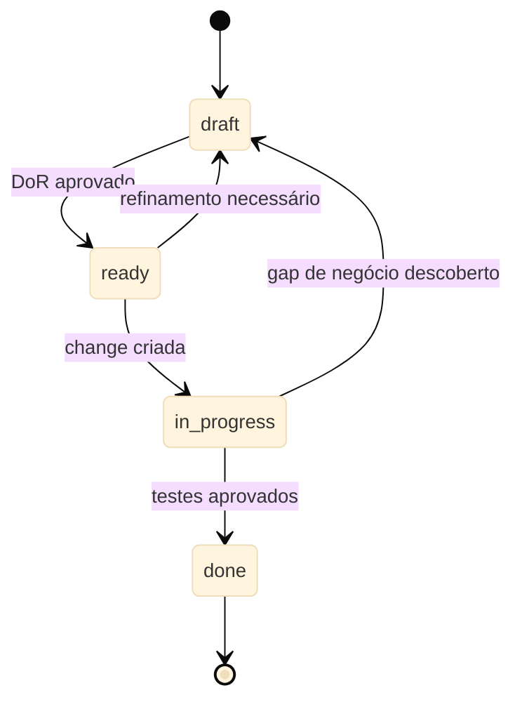
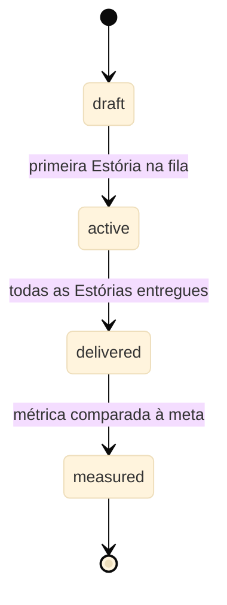
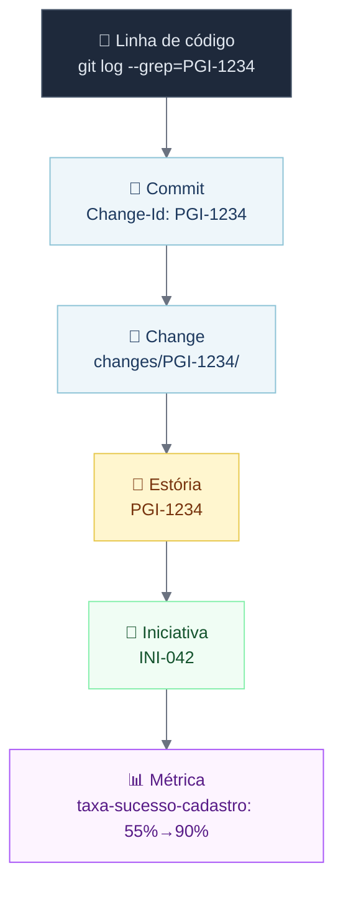

# Agentes de IA na Prática
## Ciclo de Vida do Desenvolvimento de Software

**Autores:** Diego Lírio & Marcelo Marinho

> **Para times mistos de Product Owners, Desenvolvedores e QAs.**
>
> Este curso mostra como agentes de IA transformam cada etapa do ciclo de vida do desenvolvimento de software — do refinamento de negócio até os testes em produção.
> Você vai acompanhar uma única iniciativa do zero até a entrega: **"Operador cadastra um produto pelo portal"**.

---

## Antes de começar: o princípio que governa tudo

> **A IA executa. O humano decide.**
>
> Nunca terceirize suas decisões. Deu certo foi você. Deu errado também foi você.

Essa distinção parece óbvia, mas é onde os times erram. Os agentes de IA podem escrever o PRD, desenhar telas, quebrar estórias, propor arquitetura, escrever código e testes. O que eles não fazem: escolher qual problema resolver, definir o que é aceitável, decidir o que entra em escopo ou assumir o risco.

**"Cem por cento implementado por IA" não é "cem por cento decidido por IA."** Confundir as duas coisas é o único jeito garantido de esse modelo falhar.

Os gates ao longo do fluxo existem para tornar visível quem leu, entendeu e assinou embaixo. Aprovar sem ler é terceirizar a decisão — e o fluxo não protege ninguém disso.

## Regra de materialização

> **Só existe o que está no git.**

Ferramentas de ideação — Claude Projects, Claude Design — não têm diff, Pull Request nem histórico revisável. São superfícies **descartáveis**.

Nada avança de etapa antes de o resultado ser materializado como arquivo commitado no repositório de especificação. O protótipo vira tokens e imagens versionadas. A conversa vira PRD. Conteúdo que ficou apenas na ferramenta não existe, não é aprovado e não desce para o Downstream.

---

## Os dois laços

O ciclo de vida do desenvolvimento de software neste modelo funciona em dois ritmos que giram em paralelo, ligados por uma fila.

**Upstream — cadência de produto (semanas).** Pega uma aposta de negócio e a transforma em Estórias prontas para construir. Produto conduz. Agentes de IA escrevem. O PO decide.

**Downstream — cadência de engenharia (dias).** Pega uma Estória pronta e a leva até produção com testes. Engenharia conduz. Agentes de IA constroem. O Dev e o QA decidem.

**A fila é o único ponto de contato entre os dois laços.** O Upstream escreve nela; o Downstream lê. Nenhum lado espera o outro terminar. É isso que impede o modelo de virar uma cascata com nome novo.



A mesma lógica — fases iguais, gargalos e proporções diferentes — é como o Google caracteriza a transição do SDLC tradicional para o AI-Driven:



> **Fonte:** *AI-Driven Software Development Life Cycle* — referência externa que converge com o modelo deste curso: no ciclo AI-Driven, o gargalo migra para a qualidade da especificação, a implementação colapsa de semanas para horas, e a iteração passa de sprints para minutos.

---

## A iniciativa de exemplo

Durante todo o curso, vamos acompanhar a iniciativa **INI-042**: permitir que operadores cadastrem produtos diretamente pelo portal de gestão. É uma funcionalidade comum em sistemas de backoffice — simples o suficiente para caber num curso, complexa o suficiente para cobrir todas as etapas.

A Estória central se chama **PGI-1234: "Operador cadastra um produto pelo portal"** e atravessa backend, BFF e portal web.

## Topologia de repositórios

A especificação **não mora onde o código mora**. O ciclo de vida de uma intenção é o ciclo da Estória de negócio, não o ciclo de build de nenhuma stack.

```
{product}-workspace             ← repositório de especificação · a fonte da verdade
├── initiatives/
│   ├── INI-042/                ← PRD, persona, métricas, volumetria, telas
│   │   └── stories/
│   │       └── PGI-1234/       ← a fila de Estórias
│   └── transcripts/
├── knowledge/
│   └── indices.md
├── design-system/              ← tokens e catálogo de componentes, por superfície
├── openspec/
│   ├── changes/PGI-1234/       ← proposal, design, tasks
│   └── specs/                  ← capacidades vivas + technical-debt.md
└── architecture/
    ├── overview.md             ← descrição dos sistemas/módulos
    └── refinement/specs/
```

Cada desenvolvedor clona todos os repositórios num workspace único:

```
~/workspace/{product}/
├── {product}-workspace/              ← especificação · a fonte da verdade
├── {product}-backend/
├── {product}-bffs/
├── {product}-ios/
├── {product}-android/
├── {product}-web-internal-portal/
└── {product}-web/                    ← extranet
```

O agente de IA lê o repositório de especificação e escreve no repositório de código **na mesma sessão**. Sem essa configuração, o `Change-Id` é convenção no papel. Com ela, rastreabilidade é automática.

**Por que separado.** Repositórios de código já existem, cada um com pipeline e permissão própria. Replicar a especificação em cada um garante divergência em semanas. O repositório dedicado mantém *uma Estória, uma change* íntegra atravessando stacks distintas — e o Upstream inteiro passa a ser versionado e revisável por Pull Request.

---

# Fase 1 — Requirements

> **O que esta fase resolve:** transformar uma aposta de negócio em Estórias prontas para engenharia construir — com contexto suficiente para os agentes de IA não precisarem inventar o que não foi dito.

Esta fase tem quatro etapas, todas conduzidas pelo Product Owner com suporte de agentes de IA especializados em produto.

---

## Etapa 0 — Exploratório

### O que é

A fase exploratória não produz decisão. Produz **matéria-prima**: transcrições de reuniões com clientes, dados de operação, reclamações recorrentes, benchmarks de mercado, hipóteses soltas, perguntas em aberto.

Tudo isso vira contexto para os agentes de IA. Uma exploração que ficou numa reunião não alimenta nada. A mesma exploração registrada em arquivo alimenta o refinamento, o design e a discussão técnica — sem que ninguém precise lembrar do que foi dito.

### Onde fica

```
initiatives/INI-042/explorations/
  ├── 2026-08-10-entrevista-cliente-ana.md
  ├── 2026-08-12-dados-erro-cadastro.md
  └── 2026-08-13-benchmark-concorrentes.md
```

### Como fazer — passo a passo

**1. Registre tudo como arquivo, imediatamente após acontecer.**

Não existe formato obrigatório. O que importa é que chegue ao repositório. Uma transcrição bruta é melhor do que uma síntese que ficou no caderno.

**2. Use um agente de IA para organizar e extrair perguntas em aberto.**

Exemplo de prompt para o Agente Product Owner:

> "Leia os arquivos em `explorations/` e me liste: (a) os problemas que aparecem com mais frequência, (b) as hipóteses que ainda não foram validadas, (c) os dados que estão faltando para tomar uma decisão."

**3. Acumule até sentir que há aposta suficiente.**

Não existe gate nesta etapa. Você não aprova exploração — você a acumula. Exigir aprovação para explorar mata a exploração.

### Exemplo — INI-042

A equipe fez três sessões de observação com operadores que cadastravam produtos via planilha de e-mail. Os arquivos em `explorations/` têm transcrições, prints do fluxo atual e o levantamento de erros por etapa (45% dos cadastros chegam com campos obrigatórios em branco).

Quando o PO decidiu que ali havia uma aposta, esses arquivos viraram o insumo direto da Etapa 1 — e o `gaps.md` nasceu já populado com as perguntas que as sessões deixaram abertas.

### O que dá errado

- **Exploração que fica só na cabeça.** Se não está no repositório, para a IA não existe.
- **Querer aprovar antes de explorar.** Essa etapa é deliberadamente sem gate.
- **Síntese prematura.** Registre o bruto agora; sintetize na Etapa 1.

---

## Etapa 1 — Refinamento de Negócio

### O que é

A Etapa 1 transforma uma aposta em um conjunto de documentos que a IA e a engenharia vão usar durante todo o resto do fluxo. O produto final não é um documento lindo — é um conjunto de arquivos que fecham as ambiguidades antes que elas custem caro.

### Artefatos de saída

```
initiatives/INI-042/
  ├── prd.md          ← problema, regras, escopo e não-escopo
  ├── persona.md      ← quem é, contexto de uso, dores
  ├── metrics.md      ← métricas, gatilhos, baseline, meta
  ├── rollout.md      ← volumetria, campanhas, picos, sazonalidade
  └── gaps.md         ← ambiguidades: resolvidas e em aberto
```

### Como fazer — passo a passo

**1. Abra uma sessão com o Agente de IA de Product Owner.**

Passe como contexto os arquivos de `explorations/` e o `knowledge/` do produto. O agente vai conduzir o refinamento fazendo perguntas e gerando rascunhos dos cinco arquivos.

**2. Escreva o `prd.md` primeiro.**

O PRD responde quatro perguntas:
- Qual é o problema? (para quem, em que contexto, com que frequência)
- Quais são as regras de negócio? (o que pode, o que não pode)
- O que está dentro do escopo desta iniciativa?
- O que está explicitamente fora?

**Exemplo — INI-042:**

```markdown
## Problema
Operadores de backoffice cadastram produtos enviando planilhas por e-mail.
45% chegam com erros de preenchimento, gerando retrabalho e atraso na publicação.

## Regras de negócio
- Cadastro disponível apenas para operadores com perfil "Catálogo" ativo
- Todo produto exige: nome, SKU único, categoria, preço e ao menos uma imagem
- SKU deve ser único no catálogo — duplicatas são rejeitadas na submissão
- Produto entra como "Rascunho" até aprovação do supervisor

## Escopo
Cadastro de novos produtos pelo portal web de gestão.

## Fora de escopo
Edição de produtos existentes, exclusão, aprovação e publicação.
```

**3. Escreva o `metrics.md` — e leve a sério.**

Este arquivo não é decoração. Toda Estória da iniciativa vai declarar quais métricas move, e o teste end-to-end vai cobrir essas métricas. Sem esse elo, a métrica no PRD é promessa que ninguém cobra.

```markdown
## Taxa de sucesso no cadastro
- Baseline: 55% (45% chegam com erro ou são devolvidos)
- Meta: 90% de cadastros submetidos sem erro em 60 dias após o lançamento
- Gatilho: queda abaixo de 75% aciona investigação imediata
```

**4. Escreva o `rollout.md` — o Downstream vai precisar.**

A volumetria declarada aqui vai parametrizar o teste de carga no final do fluxo. "Campanha com 200 mil clientes no primeiro dia" deixa de ser conversa de corredor e vira o número que o QA usa. Quem sabe o volume é o Upstream; quem precisa é o Downstream.

```markdown
## Volumetria esperada
- Base de operadores: 1.200 usuários com perfil "Catálogo"
- Lançamento em fases: 50 operadores piloto na semana 1, todos na semana 2
- Pico esperado: segunda-feira de manhã, 9h–11h (abertura da semana)
- Estimativa de pico: 600 cadastros/hora
```

**5. Mantenha o `gaps.md` vivo.**

Cada ambiguidade que surgir vai para este arquivo — com status: resolvida ou em aberto. Gap em aberto marcado como bloqueante impede a promoção para a próxima etapa.

```markdown
## Gaps

### [RESOLVIDO] O que acontece se o SKU já existe no catálogo?
Resposta: rejeitar na submissão com mensagem clara indicando o produto existente.

### [ABERTO - BLOQUEANTE] O supervisor pode ser o mesmo operador que cadastrou?
Ainda sem decisão de negócio. Bloqueia o design do fluxo de aprovação.
```

**6. Abra o Pull Request.**

Quando os cinco arquivos estiverem prontos e todos os gaps bloqueantes resolvidos, o PO abre o PR para revisão.

### Gate de saída

Pull Request aprovado pelo Product Owner **e** nenhum gap marcado como bloqueante em aberto.

### O que dá errado

- **Métricas sem baseline.** "Aumentar a conversão" não é métrica — "passar de 63% para 85%" é.
- **Volumetria inventada.** Se o time não sabe o volume, o `rollout.md` precisa ter uma estimativa explícita com a incerteza documentada — não pode ficar vazio.
- **Gaps escondidos.** Times que não registram ambiguidades descobrem elas na implementação, quando custam dez vezes mais.

---

## Etapa 2 — Design de Telas

### O que é

A Etapa 2 decide como o cliente vê e usa a funcionalidade, em cada plataforma. O resultado são especificações de tela versionadas — não protótipos descartáveis.

### Artefatos de saída

```
initiatives/INI-042/screens/
  └── web/
      ├── produto-lista.md       + produto-lista.png
      ├── produto-form.md        + produto-form.png
      └── produto-confirmacao.md + produto-confirmacao.png
```

Cada `{screen-id}.md` contém: propósito da tela, regras de usabilidade, componentes do design system utilizados, e obrigatoriamente os **estados de carregando, vazio e erro**.

### Como fazer — passo a passo

**1. Alimente o Claude Design com o design system.**

O `design-system/` fica na raiz do repositório — não dentro da iniciativa. Ele é **entrada** do Claude Design. Sem alimentá-lo, a ferramenta vai inventar componentes que não existem, gerando trabalho triplo depois.

**2. Para cada tela, especifique os três estados obrigatórios.**

Estados de carregando, vazio e erro são obrigatórios porque são exatamente a ambiguidade que sempre vaza para o Downstream e vira decisão solitária de quem estava com o teclado na mão às três da tarde.

**Exemplo — tela `produto-form`:**

```markdown
## produto-form — Formulário de cadastro de produto

**Propósito:** o operador preenche os dados do novo produto.

**Componentes:** InputTexto, InputPreco, SelectCategoria, UploadImagem, BotaoPrimario, BotaoSecundario

**Estado normal:**
- Campos: Nome, SKU, Categoria (select), Preço, Imagem (upload)
- Botão "Salvar rascunho" sempre habilitado
- Botão "Submeter para aprovação" habilitado apenas quando todos os campos obrigatórios estão preenchidos

**Estado carregando (ao submeter):**
- Botões desabilitados com spinner
- Mensagem: "Salvando produto..."

**Estado erro (SKU duplicado):**
- Campo SKU destacado em vermelho
- Mensagem inline: "Este SKU já existe. Veja o produto: [link]"

**Estado erro (falha de rede):**
- Toast no topo: "Não conseguimos salvar. Seus dados foram preservados. Tente novamente."
```

**3. Versione as imagens junto com o `.md`.**

Cada `{screen-id}.png` vive ao lado do `.md`. Imagem que ficou só na ferramenta de design não existe.

**4. Declare explicitamente componentes novos.**

Se uma tela precisa de um componente que não existe no design system, isso vai para o gate — não é uma decisão silenciosa. Um componente novo custa três implementações: iOS nativo, Android nativo e web.

### Exemplo real — saída do Claude Design

O Claude Design gera as telas a partir do PRD e do design system. O resultado é versionado em Pull Request — não fica preso na ferramenta.

A seguir, o output gerado para o fluxo de login da plataforma **Analizza.ai**: mesma especificação, web e mobile gerados em paralelo pelo Claude Design.



> O mesmo design system alimentou as duas gerações. Os componentes, a paleta de cores e a tipografia são consistentes — o que muda é o layout responsivo e os padrões de navegação de cada plataforma.

### Gate de saída

Pull Request aprovado por Produto e Design **e** toda tela referencia componentes existentes ou declara explicitamente um componente novo.

### O que dá errado

- **Design sem estados de erro.** O dev inventa o comportamento na hora — e geralmente erva para o usuário.
- **Componentes novos não declarados.** Viram surpresa no meio da implementação.
- **Design system desatualizado como entrada.** A IA vai gerar telas baseadas no que está no arquivo.

---

## Etapa 3 — Quebra em Estórias e Definition of Ready

### O que é

Esta é a etapa mais crítica do Upstream. A Estória é o único ponto onde Upstream e Downstream se tocam — e ela precisa estar certa antes de chegar à engenharia.

### A decisão que faz o sistema funcionar

O critério de aceite da Estória é escrito **no mesmo formato do scenario da especificação técnica**. Não é formato parecido — é o mesmo.

Por quê? O ponto onde processos perdem intenção é a tradução. Alguém escreve o critério em linguagem de negócio e outra pessoa reescreve em linguagem técnica. Toda reescrita perde algo, e o que se perde aparece em produção. Com o formato unificado, a engenharia **transcreve** em vez de traduzir.

### Formato da Estória

```yaml
---
id: PGI-1234
initiative: INI-042
title: Operador cadastra um produto pelo portal
stacks: [backend, bffs, web-internal-portal]
screens: [web/produto-lista, web/produto-form, web/produto-confirmacao]
metrics: [taxa-sucesso-cadastro]
depends_on: [PGI-1233]
status: ready
---
```

O corpo tem cinco blocos:

**1. Persona e contexto** — referência ao `persona.md`:

```markdown
## Persona
Carlos, 28 anos, operador de backoffice em uma empresa de e-commerce.
Contexto: começa a semana cadastrando os produtos novos que chegaram do fornecedor.
Referência completa: `initiatives/INI-042/persona.md`
```

**2. Regra de negócio** — o recorte desta Estória:

```markdown
## Regra de negócio
Carlos pode cadastrar produtos com perfil "Catálogo" ativo.
Todo produto exige nome, SKU único, categoria, preço e ao menos uma imagem.
O produto entra como "Rascunho" até um supervisor aprovar.
```

**3. Critérios de aceite** — em formato WHEN / THEN:

```markdown
## Critérios de aceite

WHEN Carlos preenche todos os campos obrigatórios e clica em "Submeter para aprovação"
THEN o portal exibe a tela de confirmação com o resumo do produto e o status "Aguardando aprovação"

WHEN Carlos tenta submeter um SKU que já existe no catálogo
THEN o portal exibe mensagem de erro inline no campo SKU sem limpar os demais campos

WHEN Carlos tenta submeter sem uma imagem anexada
THEN o botão "Submeter para aprovação" permanece desabilitado e o campo de imagem é destacado

WHEN o backend confirma o cadastro
THEN o portal exibe o número do protocolo e redireciona Carlos para a lista de produtos
```

**4. Fora de escopo** — o que deliberadamente não entra:

```markdown
## Fora de escopo
- Edição de produtos já cadastrados
- Fluxo de aprovação pelo supervisor
- Exclusão e arquivamento de produtos
```

**5. Gaps em aberto** — obrigatoriamente vazio para `status: ready`:

```markdown
## Gaps em aberto
(nenhum)
```

### A regra de fatiamento

> **Uma Estória precisa ser demonstrável sozinha.**

Fatia vertical fina, atravessando todas as stacks necessárias. Nunca fatia horizontal por camada.

| ❌ Fatia horizontal (errada) | ✅ Fatia vertical (certa) |
|---|---|
| "Criar o endpoint de cadastro" | "Operador cadastra um produto pelo portal" |
| Não dá para demonstrar | Dá para demonstrar |
| Ninguém sabe se está certo até o app chegar | Alguém consegue olhar e dizer se está certo |

"Criar o endpoint" não é Estória: não é demonstrável, e o critério de aceite vira validação de contrato de API — não de comportamento de negócio.

### Definition of Ready — verificação automática

Uma skill roda no Pull Request e valida mecanicamente:

1. `stacks` não vazio e todo valor mapeia para um repositório conhecido
2. Ao menos um critério de aceite em formato WHEN / THEN
3. Toda tela referenciada existe em `screens/`
4. Toda métrica referenciada existe em `metrics.md`
5. Nenhum gap bloqueante em aberto
6. `depends_on` aponta para Estórias existentes, sem ciclo
7. Acima de sete critérios de aceite → aviso de fatiamento (não reprovação)

Se reprovar, a Estória volta para o Upstream. Ambiguidade de negócio não se resolve dentro da implementação.

### Como fazer — passo a passo

**1. Abra uma sessão com o agente de IA de produto (Claude Cowork).**

Passe o PRD aprovado, as telas aprovadas e o `persona.md`. O agente vai propor um fatiamento inicial.

**2. Revise o fatiamento com o Tech Lead.**

O Tech Lead é consultado nesta etapa — não para decidir o negócio, mas para garantir que o fatiamento é tecnicamente implementável e que o campo `stacks` está correto.

**3. Escreva os critérios de aceite em WHEN / THEN.**

Cada critério precisa ser verificável. "O app funciona corretamente" não é critério. "WHEN Ana informa R$ 50,00 THEN o botão de confirmação permanece desabilitado" é critério.

**4. Preencha `depends_on`.**

Se esta Estória depende de outra (por exemplo, o login biométrico precisa estar pronto), declare explicitamente. A skill valida se há ciclos.

**5. Abra o PR e aguarde a skill validar.**

Quando a Definition of Ready passar, o PO aprova e a Estória entra na fila.

### Gate de saída

Definition of Ready validado pela skill **e** Product Owner aprova o PR.

### O que dá errado

- **Critério de aceite em linguagem natural vaga.** "O usuário vê a confirmação" precisa virar "WHEN... THEN...".
- **Fatia horizontal.** A change fecha sem entregar nada verificável.
- **Dependências implícitas.** O `depends_on` vazio com dependência real gera bloqueio no meio da implementação.

---

# Fase 2 — Refinamento Técnico e Implementação

> **O que esta fase resolve:** decidir COMO construir antes de começar a construir — é aqui que os agentes de IA entram como parceiros da engenharia, com um contrato congelado que permite que múltiplas stacks trabalhem em paralelo.

---

## Etapa 4 — Refinamento Técnico com Openspec

### O que é

A Etapa 4 pega a Estória pronta e decide a arquitetura técnica da solução. O artefato central é o `design.md` — que congela o contrato entre as stacks antes de qualquer linha de código ser escrita.

### Artefatos de saída

```
openspec/changes/PGI-1234/
  ├── proposal.md      ← transcrição dos critérios de aceite (não reescrita)
  ├── design.md        ← o COMO: passos numerados, dependências, riscos
  ├── tasks.md         ← fases derivadas do campo stacks
  └── tests.md         ← gerado por skill a partir dos cenários

openspec/specs/
  └── produto/
      └── spec.md      ← delta: ADDED / MODIFIED / REMOVED
```

### A distinção crítica: transcrever, não traduzir

O `proposal.md` **transcreve** os critérios de aceite da Estória — não os reescreve. É o mesmo texto, no mesmo formato WHEN / THEN. Esta é a cláusula que elimina a perda de intenção entre negócio e engenharia.

**Exemplo — proposal.md para PGI-1234:**

```markdown
## Proposta técnica — PGI-1234

Origem: `initiatives/INI-042/stories/PGI-1234/story.md`

### Critérios transcritos

WHEN Carlos preenche todos os campos obrigatórios e clica em "Submeter para aprovação"
THEN o portal exibe a tela de confirmação com o resumo do produto e o status "Aguardando aprovação"

WHEN Carlos tenta submeter um SKU que já existe no catálogo
THEN o portal exibe mensagem de erro inline no campo SKU sem limpar os demais campos

[... demais critérios ...]
```

### O contrato congelado

Com quatro stacks em jogo (backend, BFF, iOS, Android), a sequência linear mataria a agilidade. A cláusula que resolve isso:

**O `design.md` congela os endpoints, payloads e eventos antes de qualquer implementação começar.** Com o contrato congelado, as quatro stacks trabalham em paralelo.



A ordem `backend → BFF → clientes` vale para **integração e merge** — não para início do trabalho. Sem essa cláusula, a Estória levaria a soma dos tempos de todas as stacks em vez do maior deles.

**Exemplo — trecho do design.md para PGI-1234:**

```markdown
## Contrato de API

### POST /v1/produtos

**Request:**
```json
{
  "nome": "Camiseta Polo Azul",
  "sku": "CAM-POLO-AZ-M",
  "categoriaId": "cat-456",
  "preco": 89.90,
  "imagemUrl": "https://cdn.exemplo.com/imgs/cam-polo-az-m.jpg"
}
```

**Response 201:**
```json
{
  "protocoloId": "PRD-12345",
  "status": "RASCUNHO",
  "criadoEm": "2026-08-29T09:14:00Z"
}
```

**Response 422 — SKU duplicado:**
```json
{
  "codigo": "SKU_DUPLICADO",
  "mensagem": "SKU já cadastrado",
  "produtoExistenteId": "prd-789"
}
```

Este contrato está congelado. Qualquer alteração exige PR aprovado no `design.md`
antes de qualquer mudança no código.
```

### Como fazer — passo a passo

**1. Abra uma sessão com o agente de IA de engenharia (Claude Code) com as skills de especificação.**

O repositório de specs e o repositório alvo ficam lado a lado no workspace. O agente lê a Estória e escreve a proposta técnica na mesma sessão.

**2. Escreva o `proposal.md` transcrevendo os critérios.**

Copie os WHEN / THEN da Estória. Não reescreva.

**3. Escreva o `design.md` com o contrato.**

Para cada interface entre stacks, defina: endpoint, payload de request, payloads de response (todos os casos), e eventos assíncronos se houver. Inclua diagramas de sequência para fluxos não óbvios.

**4. Escreva o `tasks.md` a partir do campo `stacks`.**

As fases derivam automaticamente das stacks declaradas na Estória:

```markdown
## Fases

### Fase 1 — Backend (repositório: produto-backend)
- [ ] Endpoint POST /v1/produtos
- [ ] Validação de SKU único
- [ ] Regras de negócio (campos obrigatórios, perfil de acesso)
- [ ] Instrumentação da métrica taxa-sucesso-cadastro
- [ ] Testes de container

### Fase 2 — BFF (repositório: produto-bffs)
- [ ] Adapter para o backend
- [ ] Tratamento de erros (SKU duplicado, campos inválidos)
- [ ] Testes de container

### Fase 3 — Web (repositório: produto-web-internal-portal)
- [ ] Fluxo de telas (lista → formulário → confirmação)
- [ ] Validação inline de SKU antes de submeter
- [ ] Estados de carregando, erro de rede e confirmação
- [ ] Testes de UI com Playwright
```

**5. Gere o `tests.md` com a skill de teste.**

A skill lê os critérios do `proposal.md` e gera os casos de teste que o QA vai executar na Etapa 6. Não é o QA que cria os casos — é a mesma especificação que os gera.

**6. Abra o PR e aguarde aprovação do Tech Lead.**

### Gate de saída

Pull Request aprovado pelo Tech Lead.

### O que dá errado

- **Mudar o contrato direto no código.** O `design.md` é a fonte da verdade. Mudança no contrato sem PR atualiza o código mas não a especificação — e a divergência aparece no teste de carga.
- **Fases em sequência por escolha.** Com o contrato congelado, não há motivo técnico para serializar. Fases em sequência são desperdício.
- **Instrumentação esquecida.** A tarefa de instrumentar as métricas declaradas em `metrics.md` entra no `tasks.md` — não é etapa separada.

---

## Etapa 5 — Implementação

### O que é

Com o contrato congelado e as tasks mapeadas, cada desenvolvedor trabalha no seu repositório com um agente de IA ao lado. O agente constrói; o dev conduz e decide.

### Como fazer — passo a passo

**1. Clone o workspace central.**

```
~/workspace/produto/
├── produto-specs/      ← o repositório de especificação
├── produto-backend/
├── produto-bff-app/
├── produto-ios/
└── produto-android/
```

O agente enxerga a especificação e o código alvo na mesma sessão. Sem isso, o `Change-Id` é convenção no papel.

**2. Crie a branch com o nome da change.**

```bash
git checkout -b PGI-1234-cadastro-produto
```

**3. O teste precede o código — sempre.**

Desenvolvimento guiado por testes não é opcional neste fluxo. Para cada critério de aceite, escreva o teste antes de escrever a implementação.

**Exemplo — backend, critério de horário:**

```kotlin
// Teste primeiro
@Test
fun `deve rejeitar cadastro com SKU duplicado`() {
    produtoRepository.salvar(Produto(sku = "CAM-POLO-AZ-M", nome = "Produto existente"))

    val resultado = servicoProduto.cadastrar(
        NovoProduto(
            nome = "Camiseta Polo Azul",
            sku = "CAM-POLO-AZ-M",
            categoriaId = "cat-456",
            preco = BigDecimal("89.90")
        )
    )

    assertThat(resultado).isInstanceOf(ResultadoCadastro.SkuDuplicado::class.java)
}

// Implementação depois
fun cadastrar(produto: NovoProduto): ResultadoCadastro {
    if (produtoRepository.existePorSku(produto.sku)) {
        return ResultadoCadastro.SkuDuplicado(skuExistente = produto.sku)
    }
    // ...
}
```

**4. Cada commit carrega o `Change-Id`.**

```bash
git commit -m "feat: validação de SKU duplicado no endpoint de cadastro

Change-Id: PGI-1234"
```

Rastreabilidade completa sai de um `git log --grep=PGI-1234` — sem ferramenta nova.

**5. Trabalhe pelas tasks do `tasks.md`.**

A cada task concluída, marque no arquivo. A change não avança enquanto uma task estiver aberta em qualquer stack.

**6. A integração contínua precisa ficar verde antes de avançar.**

Testes unitários e de container são parte da implementação — não etapa posterior. CI verde em todos os repositórios é condição para a Estória entrar na Etapa 6.

### Gate de saída

Integração contínua verde em todos os repositórios tocados **e** todas as tasks de todas as fases marcadas como concluídas.

### O que dá errado

- **Testes escritos depois do código.** O teste escrito para "passar" não verifica comportamento — verifica que o código que já existe não explode.
- **Change-Id esquecido.** A rastreabilidade quebra. Um `git log` futuro não consegue mais ligar o código à Estória.
- **Merge antes de todas as stacks estarem verdes.** A Estória se fragmenta entre repositórios — e o critério de aceite de negócio fica sem dono.

---

# Fase 3 — Testes End to End

> **O que esta fase resolve:** provar que o que foi construído faz o que foi pedido — agentes de IA autônomos de QA executam essa verificação usando a mesma especificação que guiou a construção, sem reescrita.

---

## Etapa 6 — Spec-Driven Testing

### A passagem de bastão

O que torna esta etapa diferente de um ciclo de testes convencional é **o que atravessa** da engenharia para o QA.

Em um ciclo convencional, o QA recebe a funcionalidade pronta e reescreve o entendimento dela em casos de teste. Essa reescrita é onde a intenção se perde — e o que se perde só aparece em produção.

Neste fluxo, o critério de aceite foi escrito uma vez, no Upstream, e é o mesmo objeto que o código implementou e que o teste verifica. O QA não reescreve o entendimento de ninguém.



### O que o QA recebe

Quando a implementação passa no gate de CI, o QA recebe:

- O `tests.md` — gerado na Etapa 4 a partir dos critérios de aceite
- O código pronto em todos os repositórios
- O `rollout.md` — com os números de volumetria para o teste de carga

### Como fazer — passo a passo

**1. Abra uma sessão com o agente de IA de QA (Claude Code) com as skills de teste.**

O agente lê o `tests.md` e gera os scripts de teste. Não é o QA que escreve os testes — é a especificação que os gera, e o agente que os executa.

**2. Execute os testes end-to-end pela API (sem mocks na cadeia).**

```
App iOS/Android → BFF → Backend
```

Sem mocks. O valor do teste está em atravessar as camadas reais que o BFF introduziu. Um mock de BFF testa o cliente, não o sistema.

**Exemplo — teste E2E para o critério de horário:**

```python
def test_cadastro_com_sku_duplicado():
    # Arrange: operador autenticado e SKU já existente
    operador = autenticar_operador(login="carlos@empresa.com")
    criar_produto_existente(sku="CAM-POLO-AZ-M")

    # Act: tenta cadastrar com o mesmo SKU
    resposta = bff.post("/produtos", json={
        "nome": "Camiseta Polo Azul",
        "sku": "CAM-POLO-AZ-M",
        "categoriaId": "cat-456",
        "preco": 89.90,
        "imagemUrl": "https://cdn.exemplo.com/imgs/cam-polo-az-m.jpg"
    }, headers={"Authorization": f"Bearer {operador.token}"})

    # Assert
    assert resposta.status_code == 422
    assert resposta.json()["codigo"] == "SKU_DUPLICADO"
```

**3. Execute os testes end-to-end pela tela (simulador iOS e Android).**

O Playwright e o simulador nativo cobrem o fluxo completo de tela — da lista de produtos até a tela de confirmação com o protocolo.

**4. Execute o teste de carga com os parâmetros do `rollout.md`.**

Os números do teste de carga não são inventados pelo QA — vêm do que o Upstream declarou:

```python
# rollout.md: pico de 600 cadastros/hora com 1.200 operadores
locust_config = {
    "users": 300,          # operadores simultâneos
    "spawn_rate": 30,      # usuários/segundo
    "duration": "30m",
    "target_rps": 167      # 600 cadastros/hora ÷ 3.600 segundos
}
```

Isso fecha o ciclo: o Upstream declarou o volume esperado; o Downstream prova que aguenta.

**5. Consolide o relatório.**

O relatório lista, para cada critério de aceite:
- Status: passou / falhou
- Evidência: log, screenshot, métrica coletada

### A pirâmide de testes

A pirâmide separa o que é **parte da implementação** do que é **verificação autônoma depois dela**:

```
          ┌─────────────────────────────────┐
          │     Exploratório manual         │  ← humano
          ├─────────────────────────────────┤
          │   Resiliência e caos            │  ← QA autônomo
          ├─────────────────────────────────┤
          │         Carga                   │  ← QA autônomo
          ├─────────────────────────────────┤
          │    Ponta a ponta pela tela      │  ← QA autônomo
          ├─────────────────────────────────┤
          │  Ponta a ponta pela API         │  ← QA autônomo
          ├─────────────────────────────────┤
          │    Integração e container       │  ← parte da implementação
          ├─────────────────────────────────┤
          │         Unitários               │  ← parte da implementação
          └─────────────────────────────────┘
```

A base é larga e barata: muitos casos, rodando a cada commit. O topo é estreito e caro: poucos cenários, rodando ao fim da Estória. O único degrau ainda humano é o exploratório no topo — tudo abaixo é automático.

### Gate de saída

Relatório consolidado aprovado, com todos os critérios de aceite verificados.

Não existe aceitar com ressalva. A ressalva vira o próximo incidente.

### O que dá errado

- **Mocks na cadeia E2E.** Um mock de BFF não detecta que o BFF quebrou o contrato com o backend.
- **Teste de carga com números inventados.** O pico real bate em produção e o sistema cai.
- **Aceitar com ressalva.** "Esse critério a gente resolve na próxima sprint" — é onde os incidentes nascem.

---

# Fechamento

## Máquinas de estado

### A Estória

Uma Estória percorre cinco estados ao longo do fluxo:



- **draft:** em construção no Upstream
- **ready:** Definition of Ready aprovado — pronta para entrar no Downstream
- **in_progress:** change criada, implementação em andamento
- **done:** change arquivada, todos os testes aprovados

Se um gap de negócio for descoberto na implementação, a Estória volta para `draft` e o gap é registrado no `gaps.md`. Ambiguidade de negócio não se resolve dentro da implementação.

### A Iniciativa



- **draft:** primeiros artefatos sendo construídos
- **active:** primeira Estória na fila de prontas
- **delivered:** todas as Estórias entregues
- **measured:** métrica real comparada à meta

O estado `measured` fecha o ciclo de vida do desenvolvimento de software. **A Iniciativa não termina quando o código sobe — termina quando alguém comparou o número prometido com o número real.**

Para a INI-042: a taxa de sucesso no cadastro precisa chegar a 90% em 60 dias. Se não chegar, a Iniciativa continua aberta até que uma próxima intervenção mova o número.

---

## Rastreabilidade ponta a ponta

Uma das maiores vantagens de conduzir o ciclo de vida do desenvolvimento de software com agentes de IA é a rastreabilidade automática. A cadeia é navegável nos dois sentidos — do código à métrica, e da métrica ao código:



Na prática: pega-se uma linha de código, o `git log` dá o `Change-Id`, o `Change-Id` dá a change, a change dá a Estória, a Estória dá o PRD e a métrica que justificou aquilo existir.

Em setor regulado, com auditoria, isso se paga sozinho.

---

## Quando dá errado

| Situação | O que fazer |
|---|---|
| **Gap de negócio descoberto na implementação** | A Estória volta para `draft`. Registra o gap no `gaps.md`. Não resolve dentro da implementação. |
| **Contrato precisa mudar depois de congelado** | Atualiza o `design.md` por Pull Request. Notifica as fases dependentes. Nunca muda o contrato direto no código. |
| **Teste end-to-end reprova** | Volta para implementação. Não existe aceitar com ressalva. |
| **Estória grande demais, descoberta tarde** | Refatia. A change é arquivada, nunca deletada em silêncio. |
| **Dívida técnica identificada** | Registrada em `specs/technical-debt.md`, revisitada ao arquivar a change. |

---

## Papéis, gates e ferramentas

Referência rápida — quem conduz, quem aprova e qual ferramenta em cada etapa.

| Etapa | Conduz | Aprova | Ferramenta |
|---|---|---|---|
| 0 · Exploratório | Product Owner | Product Owner | Agente PO, Claude Projects, GitHub |
| 1 · Refinamento de Negócio | Product Owner | Product Owner | Agente PO, Claude Cowork, GitHub |
| 2 · Design de Telas | Product Owner | Design | Agente PO, Claude Design, GitHub |
| 3 · Quebra em Estórias | Product Owner | Skill valida prontidão · PO aprova | Agente PO, Claude Cowork, GitHub, Jira |
| 4 · Refinamento Técnico | Desenvolvedor | Conformidade da especificação | OpenSpec, skills, Claude Code |
| 5 · Implementação | Desenvolvedor | QA · integração contínua verde | Claude Code (Kotlin, Java, iOS, Android, React) |
| 6 · Spec-Driven Testing | QA | Conformidade da especificação · Product Owner | TestSpec, Claude Code, Playwright, simuladores iOS/Android, teste de carga |

Os gates são aprovação de Pull Request, com duas exceções: a integração contínua, que é automática, e a conformidade da especificação, verificada por skill antes de qualquer pessoa olhar.

**O Product Owner conduz todo o Upstream.** O que muda entre as etapas 0 e 3 não é quem trabalha nem qual ferramenta — é o artefato produzido e quem aprova a saída.

**O Downstream roda sempre com agentes e skills.** Etapa executada à mão é etapa que não é repetível e não é auditável.

---

## Glossário

| Termo | Significado |
|---|---|
| **Iniciativa** | Aposta de negócio com persona, regras, métricas e telas. Unidade do Upstream. |
| **Estória** | Fatia vertical demonstrável sozinha. Contrato de handoff entre Upstream e Downstream. |
| **Change** | Unidade de mudança técnica: proposta, design, tasks e delta de especificação. Uma por Estória. |
| **Fase** | Recorte da change dentro de um repositório de código. |
| **Gate** | Ponto onde uma pessoa lê, entende e assina embaixo. |
| **Gap** | Ambiguidade ou lacuna registrada. Bloqueante impede promoção de etapa. |
| **Change-Id** | Identificador que amarra Estória, change, branch e commits em todos os repositórios. |
| **Definition of Ready** | Conjunto de critérios verificáveis que uma Estória precisa satisfazer antes de entrar no Downstream. |
| **Contrato congelado** | Endpoints, payloads e eventos definidos no `design.md` antes de qualquer implementação começar. |
| **Spec-Driven Testing** | Abordagem onde os testes são gerados a partir da mesma especificação que guiou a construção. |

---

## Referências

- **Workflow AI-First — README** (`readme.md`): o documento de referência completo do qual este curso foi derivado.
- **Google — New SDLC** (`NEW_SDLC.pdf`): o paper do Google que embasou o modelo de workflow aqui descrito.

---

*Este curso é uma derivação do documento `readme.md` do projeto workflow-ai-first, organizado em formato pedagógico para times mistos de PO, Dev e QA.*
