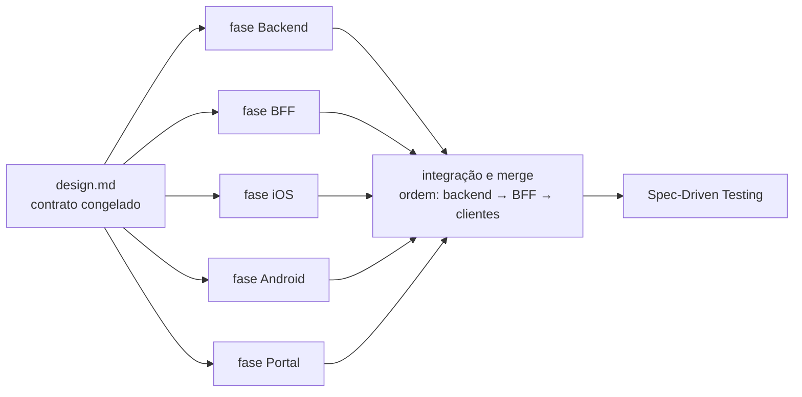
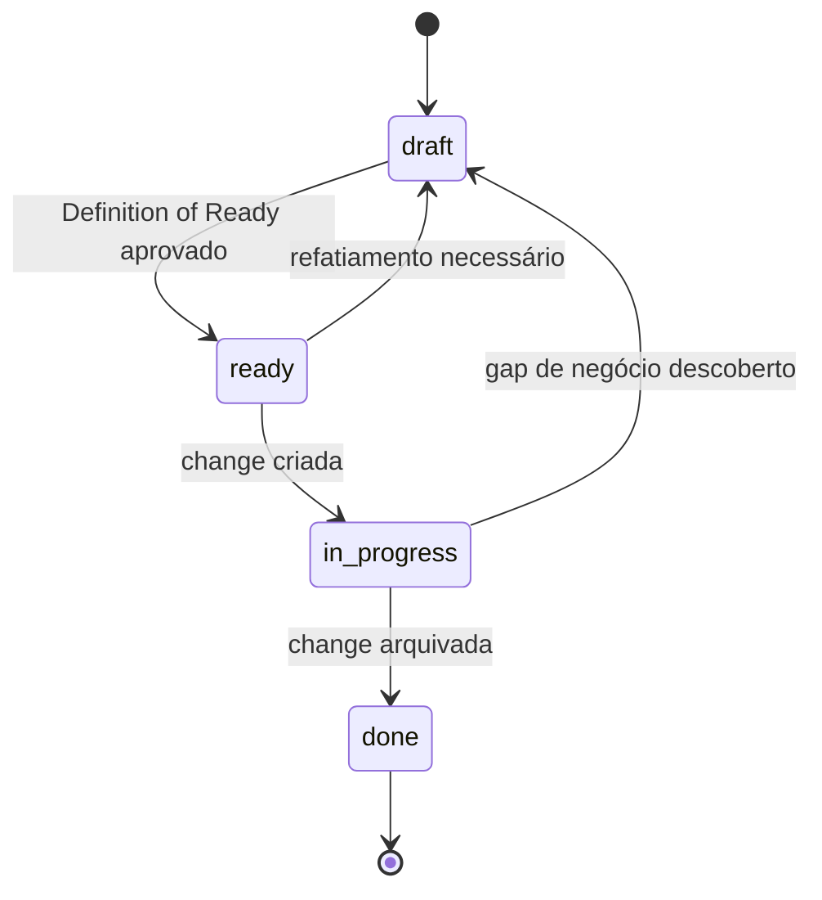
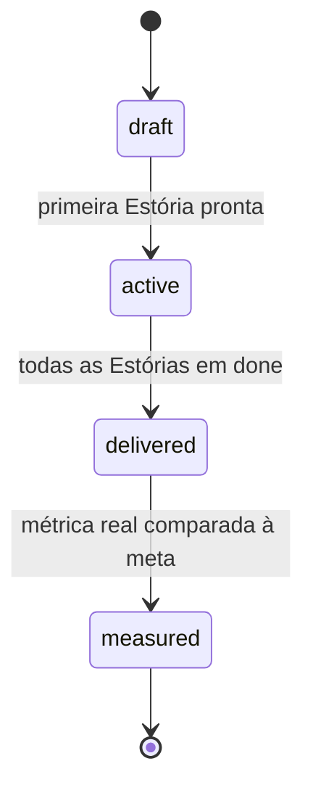
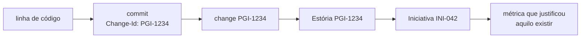

# Workflow AI-First — Upstream e Downstream

Modelo de trabalho para iniciar novos projetos, do refinamento de negócio até o teste de carga em produção, com execução conduzida por Inteligência Artificial e decisão conduzida por gente.

Este documento é um **contrato de agentes**: cada etapa declara entrada, saída, formato de artefato e gate de saída. É legível por humanos e rigoroso o bastante para virar skill sem reescrita.

---

## 1. O princípio

> **A IA executa, o humano decide.**
>
> **Nunca terceirize suas decisões. Deu certo foi você. Deu errado também foi você.**

"Cem por cento implementado por Inteligência Artificial" não é "cem por cento decidido por Inteligência Artificial", e confundir as duas coisas é o único jeito garantido de este modelo falhar.

A IA escreve o PRD, desenha as telas, quebra as estórias, propõe a arquitetura, escreve o código e escreve os testes. Ela não escolhe qual problema resolver, não decide o que é aceitável, não define o que entra em escopo e não assume o risco. Os seis gates deste fluxo existem para isso: em cada um, uma pessoa lê, entende, discorda se for o caso, e assina embaixo.

Aprovar sem ler é terceirizar a decisão. O fluxo não protege ninguém disso — só torna visível quem assinou.

---

## 2. Visão geral

O sistema é composto por **dois laços que giram em velocidades diferentes**, ligados por uma fila.

**Laço de Iniciativa — Upstream.** Gira na cadência de produto, tipicamente semanas. Uma Iniciativa é uma aposta de negócio, com persona, regras, métricas, gatilhos e telas. Seu produto final não é um documento aprovado: é um **fluxo contínuo de Estórias prontas**, liberadas conforme amadurecem.

**Laço de Estória — Downstream.** Gira na cadência de engenharia, tipicamente dias. Pega uma Estória pronta da fila e a leva até produção com testes. Vários laços giram em paralelo, inclusive de Iniciativas diferentes.

**A fila é o único acoplamento entre os dois.** O Upstream escreve nela, o Downstream lê. Nenhum lado espera o outro terminar — e é isso que impede o modelo de virar cascata com nome novo.

```mermaid
flowchart LR
    subgraph UP["UPSTREAM — cadência de produto"]
        direction TB
        RN["1 · Refinamento de Negócio<br/>PRD · persona · métricas · volumetria"]
        TL["2 · Design de Telas<br/>telas por superfície · estados obrigatórios"]
        QE["3 · Quebra em Estórias<br/>fatia vertical demonstrável"]
        RN -->|"gate: PRD aprovado<br/>sem gap bloqueante em aberto"| TL
        TL -->|"gate: design aprovado"| QE
    end

    FILA[("fila de<br/>Estórias prontas")]

    subgraph DOWN["DOWNSTREAM — cadência de engenharia · N em paralelo"]
        direction TB
        RT["4 · Refinamento Técnico<br/>change OpenSpec · contrato congelado"]
        IMPL["5 · Implementação<br/>código + testes unitários + container"]
        TEST["6 · Spec-Driven Testing<br/>aceite · end-to-end · carga"]
        RT -->|"gate: refinamento técnico aprovado"| IMPL
        IMPL -->|"gate: integração contínua verde<br/>em todos os repos"| TEST
    end

    FIM["sync de specs · arquivamento<br/>publicação em Jira e Confluence"]

    QE -->|"gate: Definition of Ready<br/>validado por skill e aprovado"| FILA
    FILA --> RT
    TEST -->|"gate: relatório aprovado"| FIM
```



---

## 3. Topologia de repositórios

A especificação **não mora onde o código mora**. O ciclo de vida de uma intenção é o ciclo da Estória de negócio, não o ciclo de build de nenhuma stack.

```
{product}-specs                  ← repositório de especificação · a fonte da verdade
├── initiatives/INI-042/         ← PRD, persona, métricas, volumetria, telas
│   └── stories/PGI-1234/        ← a fila de Estórias
├── changes/PGI-1234/            ← change OpenSpec: proposal, design, tasks, specs
├── design-system/               ← tokens e catálogo de componentes, por superfície
└── specs/                       ← capacidades vivas + technical-debt.md

{product}-backend                ┐
{product}-bff-app                │
{product}-bff-portal             │  repositórios de código
{product}-ios                    │  cadência e pipeline próprios
{product}-android                │  amarrados por Change-Id
{product}-portal                 ┘
```

**Por que separado.** Repositórios de código já existem, cada um com pipeline, permissão e cadência própria; unificá-los custaria mais do que a agilidade que se busca. Replicar a especificação em cada um garante divergência em semanas. O repositório de especificação dedicado é a única configuração que mantém *uma Estória, uma change* íntegra atravessando stacks distintas.

**O ganho não óbvio:** com repositório próprio, o Upstream inteiro passa a ser versionado e revisável por Pull Request. Produto trabalha com o mesmo mecanismo de revisão que engenharia, em vez de um wiki que ninguém sabe se está atualizado.

### Workspace central

Todo desenvolvedor clona todos os repositórios em uma pasta única:

```
~/workspace/{product}/
├── {product}-specs/
├── {product}-backend/
├── {product}-bff-app/
├── {product}-bff-portal/
├── {product}-ios/
├── {product}-android/
└── {product}-portal/
```

Um passo de bootstrap clona tudo e configura a sessão de Inteligência Artificial para enxergar o repositório de especificação e o repositório alvo lado a lado. Sem isso, o `Change-Id` é convenção no papel. Com isso, o agente lê a Estória e escreve o código na mesma sessão.

---

## 4. Regra de materialização

> **Só existe o que está no git.**

Ferramentas de ideação — Claude Projects, Claude Design — não têm diff, Pull Request nem histórico revisável. São superfícies **descartáveis**.

Nada avança de etapa antes de o resultado ser materializado como arquivo commitado em `{product}-specs`. O protótipo vira tokens, especificações de tela e imagens versionadas. A conversa vira PRD. Conteúdo que ficou apenas na ferramenta não existe, não é aprovado e não desce para o Downstream.

---

## 5. Upstream

Todas as etapas seguem o mesmo formato de contrato: **quem conduz, ferramenta, entrada, saída em arquivos, gate de saída.**

Toda etapa do Upstream mantém um registro de **ambiguidades e gaps** — resolvidos e em aberto. Essa é a função do Upstream: reduzir ambiguidade antes que ela custe caro. Gap em aberto marcado como bloqueante impede a promoção para a etapa seguinte.

### Etapa 1 — Refinamento de Negócio

**Conduz:** Product Owner
**Ferramenta:** Claude Projects para ideação, Claude Cowork para materializar
**Entrada:** uma aposta de negócio, em qualquer nível de maturidade
**Saída:** `initiatives/INI-042/`

| Arquivo | Conteúdo |
|---|---|
| `prd.md` | Problema, regras de negócio, escopo e não-escopo |
| `persona.md` | Quem é, contexto de uso, dores |
| `metrics.md` | Métricas, gatilhos, baseline atual, meta |
| `rollout.md` | Volumetria esperada, se há campanha, pico previsto, sazonalidade |
| `gaps.md` | Ambiguidades e lacunas: resolvidas e em aberto |

**Gate:** Pull Request aprovado pelo Product Owner **e** nenhum gap em aberto marcado como bloqueante.

Dois desses arquivos existem para **fechar ciclo**, não para documentar:

- **`metrics.md` vira instrumentação.** Toda Estória declara quais métricas move; isso gera tarefa de instrumentar no `tasks.md` e o teste end-to-end cobre. Sem esse elo, métrica em PRD é decoração.
- **`rollout.md` vira parâmetro de teste de carga.** "Campanha com duzentos mil clientes no primeiro dia" deixa de ser conversa de corredor e vira o número que alimenta o teste de carga no fim do Downstream. Quem sabe o volume é o Upstream; quem precisa do volume é o Downstream; normalmente os dois nunca se falam.

### Etapa 2 — Design de Telas

**Conduz:** Product Owner e Design
**Ferramenta:** Claude Design
**Entrada:** PRD aprovado
**Saída:** `initiatives/INI-042/screens/{superfície}/`

Uma pasta por design system:

```
screens/app/      ← iOS e Android · design system nativo
screens/web/      ← visão web
screens/portal/   ← ferramenta interna de operação
```

Cada tela é um `{screen-id}.md` com propósito, regras de usabilidade, componentes do design system utilizados e **obrigatoriamente os estados de carregando, vazio e erro**, com a imagem versionada ao lado.

Os três estados são obrigatórios porque são exatamente a ambiguidade que sempre vaza para o Downstream e vira decisão solitária de quem estava com o teclado na mão às três da tarde.

O `design-system/` fica na raiz do repositório, não dentro da Iniciativa. Ele é **entrada** do Claude Design, não saída: sem alimentá-lo, a ferramenta inventa componentes.

**Gate:** Pull Request aprovado por Produto e Design **e** toda tela referencia componentes existentes ou declara explicitamente um componente novo.

Essa última cláusula é deliberada: **um componente novo custa três implementações** — iOS nativo, Android nativo e web. Torná-lo explícito no gate transforma uma decisão hoje tomada por acidente numa decisão consciente, tomada por quem paga a conta.

### Etapa 3 — Quebra em Estórias

**Conduz:** Product Owner, com Tech Lead consultado
**Ferramenta:** Claude Cowork
**Entrada:** PRD e telas aprovados
**Saída:** `initiatives/INI-042/stories/PGI-1234/story.md`
**Gate:** Definition of Ready validado por skill **e** Product Owner aprova

Detalhada na seção seguinte, por ser a peça central do modelo.

---

## 6. A Estória — o contrato de handoff

Todo o resto do sistema depende desta peça estar certa, porque é o único ponto onde Upstream e Downstream se tocam.

### A decisão que faz o sistema funcionar

O critério de aceite da Estória é escrito **no mesmo formato do `#### Scenario` da especificação técnica**. Não é formato parecido — é o mesmo.

O ponto onde processos perdem intenção é a tradução: alguém escreve o critério em linguagem de negócio e outra pessoa o reescreve em linguagem técnica. Toda reescrita perde algo, e o que se perde só aparece em produção. Com o formato unificado, o Refinamento Técnico **transcreve** em vez de traduzir, e a divergência entre o que o negócio pediu e o que o teste verifica deixa de ser possível por construção.

### Formato

```yaml
---
id: PGI-1234
initiative: INI-042
title: Cliente resgata investimento pelo aplicativo
stacks: [backend, bff-app, ios, android]
screens: [app/resgate-valor, app/resgate-confirmacao]
metrics: [taxa-conclusao-resgate]
depends_on: [PGI-1233]
status: ready
---
```

O corpo tem cinco blocos:

1. **Persona e contexto** — referência ao `persona.md` da Iniciativa
2. **Regra de negócio** — o recorte específico desta Estória
3. **Critérios de aceite** — um ou mais blocos WHEN / THEN
4. **Fora de escopo** — o que deliberadamente não entra
5. **Gaps em aberto** — obrigatoriamente vazio para o status ser `ready`

O campo `stacks` decide o que está dentro e o que já está fora de escopo. Ele não é decorativo: as fases do `tasks.md` no Downstream derivam dele automaticamente, na ordem de dependência `backend → BFF → clientes`.

### Definition of Ready verificável

Uma skill roda no Pull Request e valida mecanicamente:

1. `stacks` não vazio, e todo valor mapeia para um repositório conhecido
2. Ao menos um critério de aceite em formato WHEN / THEN
3. Toda tela referenciada existe em `screens/`, quando a Estória tem interface
4. Toda métrica referenciada existe em `metrics.md`
5. Nenhum gap bloqueante em aberto
6. `depends_on` aponta para Estórias existentes, sem ciclo
7. Acima de sete critérios de aceite, sinaliza revisão de fatiamento — aviso, não reprovação

Reprovou, não promove. A Estória volta para o Upstream em vez de virar dúvida no meio da implementação.

O sétimo item é heurística, não regra. Tamanho é julgamento humano; o que a máquina faz bem é lembrar de olhar.

### A regra de fatiamento

> **Uma Estória precisa ser demonstrável sozinha.**

Fatia vertical fina, atravessando as stacks necessárias. Nunca fatia horizontal por camada.

"Criar o endpoint de resgate" não é Estória: não dá para demonstrar, e ninguém sabe se está certo até o aplicativo chegar. "Cliente resgata o valor total de um investimento pelo aplicativo" é Estória: atravessa backend, BFF e cliente, e alguém consegue olhar e dizer se está certo.

Isso não é preferência de estilo. Como uma Estória é uma change com fases por stack, uma fatia horizontal produziria uma change que fecha sem entregar nada verificável, e o gate de fechamento perderia o sentido.

---

## 7. Downstream

### Etapa 4 — Refinamento Técnico e Quebra em Tasks

**Conduz:** Tech Lead
**Ferramenta:** Claude Code com as skills de especificação
**Entrada:** Estória com status `ready`
**Saída:** `changes/PGI-1234/`

| Artefato | Origem |
|---|---|
| `proposal.md` | **Transcreve** os critérios de aceite da Estória — não reescreve |
| `design.md` | O COMO: passos numerados, dependências entre passos, riscos, diagramas |
| `specs/{capability}/spec.md` | Delta `ADDED` / `MODIFIED` / `REMOVED` |
| `tasks.md` | Fases derivadas do campo `stacks`, cada uma declarando seu repositório |
| `tests.md` | Gerado por skill a partir dos cenários |

**Gate:** Pull Request aprovado pelo Tech Lead.

Duas famílias de tarefa entram aqui e normalmente ficam de fora até virarem dívida: **instrumentação** das métricas declaradas na Estória, e **contrato entre stacks**.

#### Contrato congelado, fases em paralelo

Com quatro ou mais stacks em fila, a sequência mataria a agilidade que motivou o modelo. A cláusula que resolve isso:

**O `design.md` congela o contrato — endpoints, payloads, eventos — antes de qualquer implementação começar.** Com o contrato congelado, as fases correm em paralelo, cada desenvolvedor no seu repositório, clientes trabalhando contra o contrato acordado.

A ordem `backend → BFF → clientes` vale para **integração e merge**, não para início do trabalho. Sem essa cláusula, a Estória levaria a soma dos tempos das stacks em vez do maior deles.



### Etapa 5 — Implementação

**Conduz:** desenvolvedor conduzindo agentes
**Ferramenta:** Claude Code, um repositório por vez dentro do workspace central
**Entrada:** change aprovada
**Saída:** código, testes unitários e testes de container em cada repositório tocado

Cada fase vira uma branch com o nome da change no repositório alvo, e cada commit carrega o trailer `Change-Id: PGI-1234`. Rastreabilidade completa sai de um `git log --grep`, sem ferramenta nova.

**Testes unitários e de container são parte da implementação**, não etapa posterior. Desenvolvimento guiado por testes vale: o teste precede o código.

**Gate:** integração contínua verde em todos os repositórios tocados **e** todas as tarefas de todas as fases marcadas.

A change não avança enquanto uma stack estiver aberta. É isso que impede o critério de aceite de negócio de se fragmentar entre repositórios sem dono.

### Etapa 6 — Spec-Driven Testing

**Conduz:** QA conduzindo agentes
**Ferramenta:** Claude Code com as skills de teste
**Entrada:** change implementada e `tests.md`

| Verificação | Como |
|---|---|
| Critérios de aceite | Cada critério da Estória mapeia para ao menos um teste — rastreabilidade um-para-um |
| End-to-end aplicativo | Simulador iOS e Android: `App → BFF → Backend`, cadeia real |
| End-to-end portal | Playwright: `Portal → BFF → Backend`, cadeia real |
| Carga | Parametrizado pelos números do `rollout.md` da Iniciativa |

Sem mocks na cadeia end-to-end. O valor do teste está justamente em atravessar as camadas reais que o BFF introduziu.

O teste de carga é o segundo elo que fecha ciclo: os números não são inventados pelo QA, vêm do que o Upstream declarou de volumetria e campanha.

**Gate:** relatório consolidado aprovado, com todos os critérios de aceite verificados.

### Fechamento

Com o gate de testes aprovado: as especificações de capacidade são sincronizadas, a change vai para `changes/archive/YYYY-MM-DD-PGI-1234/`, a Estória vira `done`, e Jira e Confluence recebem os espelhos.

Quando a última Estória fecha, a Iniciativa vira `delivered`. Depois de rodar em produção, alguém compara a métrica prometida com a métrica real e ela vira `measured`.

---

## 8. Máquinas de estado

### Estória



### Iniciativa



O estado `measured` fecha o ciclo e evita o vício mais comum deste tipo de processo: definir métrica no começo e nunca mais olhar. **A Iniciativa não termina quando o código sobe — termina quando alguém comparou o gatilho prometido com o número real.**

---

## 9. Rastreabilidade

A cadeia é contínua e navegável nos dois sentidos.



Na prática, isso responde à pergunta que quase nenhuma organização consegue responder: pega-se uma linha de código, o `git log` dá o `Change-Id`, o `Change-Id` dá a change, a change dá a Estória, a Estória dá o PRD e a métrica que justificou aquilo existir.

Em setor regulado, com auditoria, isso se paga sozinho.

---

## 10. Papéis e gates

| Etapa | Conduz | Aprova |
|---|---|---|
| 1 · Refinamento de Negócio | Product Owner | Product Owner |
| 2 · Design de Telas | Produto e Design | Produto e Design |
| 3 · Quebra em Estórias | Product Owner, Tech Lead consultado | Skill valida prontidão, Product Owner aprova |
| 4 · Refinamento Técnico | Tech Lead | Tech Lead |
| 5 · Implementação | Desenvolvedor | Integração contínua verde e revisão de código |
| 6 · Spec-Driven Testing | QA | QA e Product Owner |

Todos os gates são aprovação de Pull Request, exceto o de integração contínua.

Cada envolvido tem um ponto no fluxo onde a decisão é dele e não passa sem ele. É isso que dá corpo ao princípio da seção 1.

---

## 11. Ferramentas por etapa

| Etapa | Ferramenta |
|---|---|
| Iniciativa e ideação | Claude Projects |
| Protótipo e telas | Claude Design |
| Refinamento de negócio, PRD e Estórias | Claude Cowork, commitando em `{product}-specs` |
| Refinamento técnico, especificações e implementação | Claude Code com agentes e skills |
| Validação de critério de aceite e testes end-to-end | Claude Code com agentes e skills |
| End-to-end aplicativo | Claude Code com Simulador iOS e Android |
| End-to-end portal | Claude Code com Playwright |

**O Downstream roda sempre com agentes e skills.** Etapa executada à mão é etapa que não é repetível e não é auditável.

---

## 12. Publicação — uma via só

O git é a fonte da verdade. Jira e Confluence recebem espelhos gerados, nunca lidos pelo fluxo para trabalhar.

| Destino | Conteúdo | Público |
|---|---|---|
| **Jira** | Estória, link, status e andamento | Gestão |
| **Confluence** | PRD aprovado, telas e fluxo, relatório de testes | Liderança, risco e compliance, operação, suporte, comercial |

Existe um público que nunca vai abrir o repositório e ainda assim precisa responder "qual era a regra de negócio aprovada quando isso subiu".

Toda página gerada carrega no topo um aviso de página gerada e o link para o commit de origem. **Se alguém editar no destino, a próxima geração sobrescreve.** Isso é intencional e está escrito no contrato.

---

## 13. Quando dá errado

A parte que decide se o processo sobrevive ao contato com a realidade.

| Situação | O que acontece |
|---|---|
| **Gap de negócio descoberto na implementação** | A Estória volta para `draft` e o gap é registrado no `gaps.md`. Ambiguidade de negócio não se resolve dentro da implementação — é ali que ela vira decisão silenciosa de quem estava com o teclado na mão |
| **Contrato precisa mudar depois de congelado** | Atualiza-se o `design.md` por Pull Request e as fases dependentes são notificadas. Nunca se muda o contrato direto no código |
| **Teste end-to-end reprova** | Volta para implementação. Não existe aceitar com ressalva — a ressalva vira o próximo incidente |
| **Dívida técnica identificada** | Registrada em `specs/technical-debt.md`, lida ao explorar e revisitada ao arquivar |
| **Estória grande demais, descoberta tarde** | Refatia-se. A change é arquivada, nunca deletada em silêncio |

---

## 14. O que precisa ser construído

| Item | Estado |
|---|---|
| Este documento | pronto |
| Repositório template `{product}-specs` com estrutura e templates de artefato | a construir |
| Skills do Upstream: negócio, design, quebra em Estórias, validação de prontidão | a construir |
| Skills do Downstream: proposta, aplicação, sincronização, arquivamento | adaptar para multi-repositório |
| Skills de teste: geração, especificação de QA, execução e relatório | adaptar para BFF e Simulador |
| Bootstrap do workspace central | a construir |
| Publicação em Jira e Confluence | parcial |
| Verificação de `Change-Id` e gate agregador multi-repositório na integração contínua | a construir |

O Downstream tem base pronta em modelos de especificação já existentes. O que é genuinamente novo é o **Upstream inteiro** e a **costura multi-repositório**.

---

## 15. Glossário

| Termo | Significado |
|---|---|
| **Iniciativa** | Aposta de negócio com persona, regras, métricas e telas. Unidade do Upstream |
| **Estória** | Fatia vertical demonstrável sozinha. Contrato de handoff entre Upstream e Downstream |
| **Change** | Unidade de mudança técnica: proposta, design, tasks e delta de especificação. Uma por Estória |
| **Fase** | Recorte da change dentro de um repositório de código |
| **Gate** | Ponto onde uma pessoa lê, entende e assina embaixo |
| **Gap** | Ambiguidade ou lacuna registrada. Bloqueante impede promoção de etapa |
| **Change-Id** | Identificador que amarra Estória, change, branch e commits em todos os repositórios |
